# HugeCMS 后台管理系统产品需求文档 (PRD) 与管理菜单架构规划

> **文档版本**：v1.0.0  
> **文档定位**：作为 HugeCMS 管理后台（基于 React 19 + TanStack Router + Ant Design v5 + Pro Components）研发实现、接口联调与端到端（E2E）自动化测试的基准需求规范。

---

## 一、系统菜单体系架构规划

整个后台按业务职责划分为 **7 大核心功能域、20 个业务页面**，形成清晰的左侧二级树状导航：

```mermaid
graph TD
    Root[HugeCMS 管理控制台] --> M1[1. 控制台仪表盘]
    Root --> M2[2. 内容引擎中心]
    Root --> M3[3. 分类与标签打标]
    Root --> M4[4. 互动与表单运营]
    Root --> M5[5. 数字资产与附件]
    Root --> M6[6. 站点外观与 SEO]
    Root --> M7[7. 系统权限与安全]

    M1 --> P1_1[1.1 综合监控概览 /admin/dashboard]
    
    M2 --> P2_1[2.1 内容列表与管理 /admin/contents]
    M2 --> P2_2[2.2 内容编辑与发布器 /admin/contents/edit]
    M2 --> P2_3[2.3 自定义内容模型 /admin/models]
    M2 --> P2_4[2.4 动态字段 DDL 设计器 /admin/models/:id/fields]
    M2 --> P2_5[2.5 快照安全回收站 /admin/recycle-bin]

    M3 --> P3_1[3.1 分类法与层级分类 /admin/taxonomies]
    M3 --> P3_2[3.2 标签池管理 /admin/tags]

    M4 --> P4_1[4.1 评论审核与互动 /admin/comments]
    M4 --> P4_2[4.2 自定义表单设计 /admin/forms]
    M4 --> P4_3[4.3 表单收集反馈记录 /admin/forms/:id/records]
    M4 --> P4_4[4.4 营销短链追踪 /admin/short-links]

    M5 --> P5_1[5.1 媒体图库与附件空间 /admin/attachments]

    M6 --> P6_1[6.1 站点多主题管理 /admin/appearance/themes]
    M6 --> P6_2[6.2 导航菜单编排 /admin/appearance/menus]
    M6 --> P6_3[6.3 友情链接管理 /admin/appearance/links]
    M6 --> P6_4[6.4 全站 SEO 设定 /admin/appearance/seo]

    M7 --> P7_1[7.1 管理员账号管理 /admin/system/users]
    M7 --> P7_2[7.2 角色与权限策略 /admin/system/roles]
    M7 --> P7_3[7.3 全局系统设置 /admin/system/settings]
    M7 --> P7_4[7.4 安全审计日志 /admin/system/audit-logs]
```

---

## 二、模块与页面产品需求文档（PRD）

### 模块 1：控制台仪表盘

#### 页面 1.1：综合监控概览 (`/admin/dashboard`)
- **页面目标**：为站点运维与管理员提供全站关键指标的全局驾驶舱。
- **页面功能点**：
  1. **统计指标卡片**：文章总数、今日新增、全站累计 PV、待审核评论数、表单留言数。
  2. **趋势折线图**：最近 30 天 PV/UV 访问量走势、评论与互动走势。
  3. **待办任务清单**：待审核文章、待审核评论、系统警告。
  4. **最近动态时间轴**：展示最新的管理员登录、内容发布、回收站操作事件。
- **后端对接接口**：
  - `GET /api/admin/audit-logs`
  - `GET /api/admin/contents?status=pending`
- **E2E 验收用例**：
  - [E2E-01-01] 访问首页加载成功，展示 4 个统计卡片与趋势图。
  - [E2E-01-02] 点击待审核评论，能够跳转到对应评论列表并自动带入筛选条件。

---

### 模块 2：内容引擎中心

#### 页面 2.1：内容列表与管理 (`/admin/contents`)
- **页面目标**：支持多维检索、批量操作与三维状态流转（发布/审核/可见性）。
- **页面功能点**：
  1. **高级筛选栏**：模型筛选（文章/产品/招聘）、状态过滤（草稿/已发布/已归档）、审核状态（待审/通过/拒绝）、标题模糊搜索、分类联动筛选。
  2. **数据表格**：封面缩略图、标题、所属模型、分类、阅读/评论数、置顶状态、发布时间、操作按钮。
  3. **批量操作**：批量审核通过、批量下线（移入回收站）。
  4. **三维状态直接流转**：支持直接快速置顶/取消置顶，快捷修改可见性（公开/密码/私有）。
- **后端对接接口**：
  - `GET /api/admin/contents`
  - `DELETE /api/admin/contents/:id`（软删除进回收站）
  - `PUT /api/admin/contents/:id`
- **E2E 验收用例**：
  - [E2E-02-01] 检索关键词返回包含该词条的内容，分页切换数据准确。
  - [E2E-02-02] 单击删除按钮，弹出确认框，确认后内容从列表消失，进入回收站。

#### 页面 2.2：内容编辑与发布器 (`/admin/contents/create` & `/admin/contents/:id/edit`)
- **页面目标**：动态根据内容模型渲染基础字段 + 动态扩展字段，支持实时保存与发布。
- **页面功能点**：
  1. **基础表单**：标题、URL 别名（Slug，支持根据标题自动转拼音/英文）、所属分类多选、标签打标、封面图上传组件。
  2. **动态字段区**：根据当前选中的 `model_id` 自动加载模型定义的字段控件（文本、富文本编辑器、数字、日期、图集上传）。
  3. **发布设置面板（抽屉/侧边栏）**：
     - 状态机选择：草稿 / 提交审核 / 立即发布 / 定时发布（选定日期时间）；
     - 可见性选择：公开 / 密码访问（输入密码）/ 私有内部；
     - 独立 SEO 设定：SEO 标题、关键字、描述、规范链接（Canonical URL）。
- **后端对接接口**：
  - `GET /api/admin/content-models`
  - `GET /api/admin/contents/:id`
  - `POST /api/admin/contents`
  - `PUT /api/admin/contents/:id`
- **E2E 验收用例**：
  - [E2E-02-03] 选择特定模型后，对应动态字段输入框能正确呈现。
  - [E2E-02-04] 填写完整必填项后点击“立即发布”，提示成功并重定向回内容列表。

#### 页面 2.3：自定义内容模型 (`/admin/models`)
- **页面目标**：无需改动后端代码，管理业务模型（如文章、招聘、案例、商品）。
- **页面功能点**：
  1. **模型列表**：展示模型名称、模型标识（Alias）、物理分表名（如 `data_article`）、字段计数、状态。
  2. **新建/编辑模型**：弹窗输入模型名称、标识、描述。创建时后端自动生成物理分表。
  3. **字段设计入口**：点击“字段设计”快捷跳转到该模型的 DDL 设计器。
- **后端对接接口**：
  - `GET /api/admin/content-models`
  - `POST /api/admin/content-models`
  - `PUT /api/admin/content-models/:id`
- **E2E 验收用例**：
  - [E2E-02-05] 新建标识为 `product` 的模型，创建成功后列表中包含该模型且表名为 `data_product`。

#### 页面 2.4：动态字段 DDL 设计器 (`/admin/models/:id/fields`)
- **页面目标**：为模型可视化设计附加字段，系统自动执行底层 MySQL DDL 变更。
- **页面功能点**：
  1. **字段列表**：展示字段标签（如“薪资范围”）、字段名称（如 `salary`）、字段类型（单行文本/多行文本/富文本/下拉单选/图集/数字/日期）、是否必填、排序。
  2. **添加/修改字段**：
     - 类型选择（Text, Textarea, RichText, Select, Image, Number, DateTime）；
     - 额外配置项：占位提示符、默认值、下拉选项 JSON 配置、验证规则（如正则、最大长度）。
  3. **删除字段**：高危弹窗确认，后端自动安全下线字段列。
- **后端对接接口**：
  - `GET /api/admin/model-fields?model_id=:id`
  - `POST /api/admin/model-fields`
  - `PUT /api/admin/model-fields/:id`
  - `DELETE /api/admin/model-fields/:id`
- **E2E 验收用例**：
  - [E2E-02-06] 添加类型为 `Image` 的字段 `banner`，保存后该模型编辑页能正常渲染图片上传组件。

#### 页面 2.5：快照安全回收站 (`/admin/recycle-bin`)
- **页面目标**：提供防止误删的完整快照保障，支持查看快照详情、一键无损还原或彻底物理粉碎。
- **页面功能点**：
  1. **快照列表**：原实体类型、原内容标题、删除人、删除时间、保留截止期限倒计时。
  2. **快照详情 JSON 预览**：支持查看当时关联的评论数、分类关系快照、动态字段快照。
  3. **一键还原**：恢复主表及关联数据，若 Slug 冲突自动处理。
  4. **彻底物理粉碎**：级联销毁全部关联记录与快照记录。
- **后端对接接口**：
  - `GET /api/admin/recycle-bins`
  - `POST /api/admin/recycle-bins/:id/restore`
  - `DELETE /api/admin/recycle-bins/:id`
- **E2E 验收用例**：
  - [E2E-02-07] 在回收站中对已删除文章点击“还原”，列表移出该项，内容管理列表中该文章恢复为正常状态。

---

### 模块 3：分类与标签打标

#### 页面 3.1：分类法与层级分类 (`/admin/taxonomies`)
- **页面目标**：管理多维度分类系统（文章分类、产品类目、部门架构），支持树形父子层级展开。
- **页面功能点**：
  1. **分类法切换**：支持文章分类（Category）、专题（Special）等不同维度切换。
  2. **树形表格展示**：展示分类名称、Slug、层级缩进、文章统计数、排序。
  3. **分类增删改**：输入分类名称、Slug、父分类选择、SEO 描述。
- **后端对接接口**：
  - `GET /api/admin/taxonomies`
  - `GET /api/admin/terms?taxonomy_id=:id`
  - `POST /api/admin/terms`
  - `PUT /api/admin/terms/:id`
  - `DELETE /api/admin/terms/:id`
- **E2E 验收用例**：
  - [E2E-03-01] 创建一级分类及子分类，树形表格正确显示层级缩进。

#### 页面 3.2：标签池管理 (`/admin/tags`)
- **页面目标**：扁平化标签云管理，统计引用频次与快速合并/重命名。
- **页面功能点**：
  1. **标签列表**：标签名、关联内容数、创建时间。
  2. **标签编辑/删除**：重命名标签，删除未引用的冗余标签。

---

### 模块 4：互动与表单运营

#### 页面 4.1：评论审核与互动 (`/admin/comments`)
- **页面目标**：管理前台访客评论，防垃圾广告灌水，支持审核/回复/拉黑。
- **页面功能点**：
  1. **审核列表**：状态过滤（待审/已审核/已标记垃圾）、关联文章标题链接、访客昵称、邮箱、IP、内容正文。
  2. **快速操作**：一键“通过审核”、“驳回/垃圾”、“快捷官方回复”。
- **后端对接接口**：
  - `GET /api/admin/comments`
  - `PUT /api/admin/comments/:id`（更新审核状态）
  - `POST /api/admin/comments`（管理员回复）
  - `DELETE /api/admin/comments/:id`
- **E2E 验收用例**：
  - [E2E-04-01] 对一条待审评论点击“通过”，状态变为已审核，前台页面实时可见。

#### 页面 4.2：自定义表单设计 (`/admin/forms`)
- **页面目标**：可视化创建前台收集表单（如：商务合作、需求提报、在线问卷）。
- **页面功能点**：
  1. **表单列表**：表单名称、调用标识（Code）、收集数据量、是否开启通知、状态开关。
  2. **表单设计器**：配置字段名、字段类型（单行、手机号、邮箱、下拉选择、文本域）、是否必填。

#### 页面 4.3：表单收集反馈记录 (`/admin/forms/:id/records`)
- **页面目标**：查看并导出访客提交的表单数据。
- **页面功能点**：
  1. **数据动态表格**：表头根据表单字段自适应生成。
  2. **状态标记**：未读 / 已联系 / 已跟进。
  3. **数据导出**：支持一键导出为 Excel/CSV 格式。

#### 页面 4.4：营销短链追踪 (`/admin/short-links`)
- **页面目标**：生成 `/s/:code` 推广短链，支持 PV/UV 独立统计与到期时间控制。
- **页面功能点**：
  1. **短链列表**：短链 Code、目标重定向 URL、点击总次数、创建人、有效期。
  2. **创建短链**：输入目标 URL、自定义后缀（可选）、有效期限。
- **后端对接接口**：
  - `GET /api/admin/marketing/short-links`
  - `POST /api/admin/marketing/short-links`
- **E2E 验收用例**：
  - [E2E-04-02] 创建一条短链，访问该短链能正确 302 重定向到目标页面，后台点击数 +1。

---

### 模块 5：数字资产与附件

#### 页面 5.1：媒体图库与附件空间 (`/admin/attachments`)
- **页面目标**：集中管理上传的文件、图片、视频与文档，支持引用安全保护。
- **页面功能点**：
  1. **网格与列表视图切换**：提供类似云盘的文件卡片预览与列表模式。
  2. **分类型筛选**：全部 / 图片 / 视频 / 文档 / 压缩包。
  3. **文件上传**：支持拖拽上传、进度条显示、大小与 MIME 类型限制。
  4. **引用追溯与防误删**：删除附件时若仍有文章正在引用，弹出阻止提示。
- **后端对接接口**：
  - `GET /api/admin/attachments`
  - `POST /api/common/attachment/upload`
  - `DELETE /api/admin/attachments/:id`

---

### 模块 6：站点外观与 SEO

#### 页面 6.1：站点多主题管理 (`/admin/appearance/themes`)
- **页面目标**：切换前台 SSR 渲染主题，配置主题参数。
- **页面功能点**：
  1. **主题列表卡片**：展示可用主题（如 `default`, `corporate`, `tech`）的封面预览图、版本号、作者。
  2. **一键应用激活**：切换主题，前端与后端即时生效。

#### 页面 6.2：导航菜单编排 (`/admin/appearance/menus`)
- **页面目标**：树形编排前台主导航（Header Nav）与底部导航（Footer Nav）。
- **页面功能点**：
  1. **导航菜单管理**：选择主导航或自定义菜单。
  2. **添加菜单项**：链接类型选择（内部文章、分类列表、外部自定义 URL）、标题、新窗口打开开关、支持拖拽排序。

#### 页面 6.3：友情链接管理 (`/admin/appearance/links`)
- **页面目标**：管理合作伙伴与友情链接，支持权重排序与 Logo 上传。

#### 页面 6.4：全站 SEO 设定 (`/admin/appearance/seo`)
- **页面目标**：配置全站默认搜索引擎参数与社交卡片分享设置。
- **页面功能点**：
  1. **默认 Meta 设置**：站点默认 Title 模板（如 `{title} - {site_name}`）、默认关键词、默认描述。
  2. **Sitemap 与 Robots 控制**：一键预览 `/sitemap.xml` 与 `/robots.txt`，支持手动追加 Robots 规则。

---

### 模块 7：系统权限与安全

#### 页面 7.1：管理员账号管理 (`/admin/system/users`)
- **页面目标**：管理后台使用人员账号、分配所属角色与账户锁定。
- **页面功能点**：
  1. **用户列表**：头像、用户名、姓名、邮箱、关联角色、最后登录时间、状态启用/禁用开关。
  2. **新增/修改用户**：配置基本资料、重置密码、多选分配角色。

#### 页面 7.2：角色与权限策略 (`/admin/system/roles`)
- **页面目标**：基于 RBAC 模型的细粒度权限控制。
- **页面功能点**：
  1. **角色列表**：角色名称、角色标识、角色描述、用户数。
  2. **权限分配抽屉**：以树状勾选框形式分配菜单权限与 API 操作权限（如 `content:create`, `content:publish`, `comment:audit`）。

#### 页面 7.3：全局系统设置 (`/admin/system/settings`)
- **页面目标**：管理站点基础信息、备案号、附件上传限制与邮件/存储配置。
- **页面功能点**：
  1. **站点基础**：站点名称、站点域名、版权声明、ICP 备案号、公安联网备案号。
  2. **上传限制**：单文件最大限制、允许的文件格式后缀。

#### 页面 7.4：安全审计日志 (`/admin/system/audit-logs`)
- **页面目标**：对管理员的关键操作进行合规记录与不可篡改审计。
- **页面功能点**：
  1. **日志列表**：操作人、动作类型（创建/更新/删除/登录）、操作模块、请求 IP、客户端 User-Agent、操作时间。
  2. **变更对比快照**：点击查看变更前后的 JSON Diff 差异。

---

## 三、后续研发与 E2E 自动化测试实施路线图

1. **第 1 阶段：路由骨架与通用 ProLayout 落地**
   - 在 `resource/admin/src/routes/` 依据 TanStack Router 文件路由机制，创建对应的嵌套子路由文件结构。
   - 提取通用的 Ant Design ProLayout 后台框架（顶栏、侧栏、面包屑、Tab 页签）。

2. **第 2 阶段：核心内容引擎与模型设计器页面实现**
   - 优先交付高频业务页面：内容管理（`contents`）、分类标签（`taxonomies`）、模型字段 DDL（`models/fields`）、回收站（`recycle-bin`）。

3. **第 3 阶段：运营、外观与系统设置页面实现**
   - 交付评论审核、表单收集、短链追踪、导航编排与 RBAC 权限管理页面。

4. **第 4 阶段：端到端（E2E）自动化测试套件编写**
   - 搭建 Playwright 测试环境；
   - 针对 PRD 中规划的 20 余项 E2E 验收用例进行全流程端到端自动化校验。
