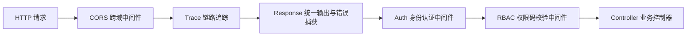
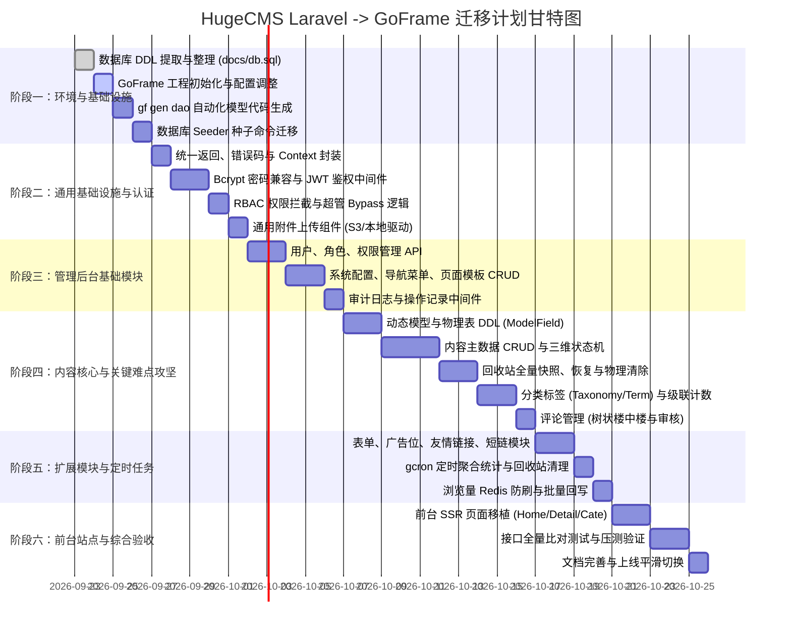

# HugeCMS 从 Laravel 迁移至 GoFrame 架构方案与实施指南

> **文档定位**：本文档旨在为 `archive/`（Laravel 11+）项目完整迁移至根目录 GoFrame（v2.10+）框架提供全局技术方案、架构对齐规范、核心业务难点攻关指导以及分阶段实施路线图。
> **关联依据**：`docs/development-conventions.md`（开发约定）、`archive/database/migrations/`（38张表结构）、`archive/app/` 业务逻辑。

---

## 目录

- [一、 迁移背景与总体目标](#一-迁移背景与总体目标)
- [二、 技术栈与架构映射](#二-技术栈与架构映射)
- [三、 数据库与模型层迁移](#三-数据库与模型层迁移)
- [四、 核心业务规则与疑难点适配方案](#四-核心业务规则与疑难点适配方案)
- [五、 接口层与控制器设计（API Specification）](#五-接口层与控制器设计api-specification)
- [六、 认证、权限与中间件机制](#六-认证权限与中间件机制)
- [七、 前后台资源划分、前台渲染（SSR）与多主题设计](#七-前后台资源划分前台渲染ssr与多主题设计)
- [八、 定时任务与控制台命令（CLI & Cron）](#八-定时任务与控制台命令cli--cron)
- [九、 分阶段实施路线图（6大阶段任务拆解）](#九-分阶段实施路线图6大阶段任务拆解)
- [十、 测试验证与平滑切换方案](#十-测试验证与平滑切换方案)

---

## 一、 迁移背景与总体目标

### 1.1 现状分析

原有系统位于 `archive/` 目录，基于 **Laravel 11/12 (PHP 8.3)** 开发，具备完整的 CMS 体系，包含：
- **38 张数据迁移表**：覆盖用户权限（RBAC）、内容模型、动态字段、分类标签、评论、附件、外观组件、营销推广、运营统计等。
- **自定义脚手架与 DDD 分层架构**：包含 `Entities`、`Models`、`Repositories`、`Services`、`Requests`、`Responses`、`Controllers`。
- **完善的开发契约**：在 `docs/development-conventions.md` 中约定了诸如“回收站全量级联快照与恢复”、“内容三维状态机”、“动态表 `data_{alias}` DDL”、“附件引用双路径跟踪与保护”等严格规则。

### 1.2 迁移目标

1. **性能跃升**：借助 Go 的高并发处理能力与协程调度，极大降低内存占用与服务响应延迟（P99 下降 80% 以上）。
2. **规范对齐**：全面采用 **GoFrame v2 工程规范**（`api` -> `controller` -> `service` -> `logic` -> `dao` -> `model`），消除 PHP 动态语言可能引入的运行时隐患。
3. **业务与数据 100% 兼容**：
   - 数据库结构、索引及外键完全保留；
   - 用户密码哈希采用 `bcrypt` 实现与 Laravel 历史数据零成本无缝兼容；
   - 所有在开发约定中规定的核心业务规则不打折扣落地。
4. **统一接口契约**：利用 GoFrame 结构化元数据（`g.Meta`）自动生成规范的 OpenAPI/Swagger 文档，替代原有 PHP 注解模式。

---

## 二、 技术栈与架构映射

### 2.1 技术栈对照

| 维度 | Laravel (源工程) | GoFrame (目标工程) | 迁移考量 / 说明 |
|---|---|---|---|
| **语言与运行时** | PHP 8.3 / FPM | Go 1.25+ / 原生并发可执行程序 | 静态编译、零依赖部署 |
| **Web 框架** | Laravel 11/12 | GoFrame v2.10.3 | 现代化企业级完整框架 |
| **路由与中间件** | `routes/web.php`、`routes/api.php` | `ghttp.Server` + 路由分组与中间件 | 分组清晰，支持前缀、参数校验 |
| **ORM / 数据访问** | Eloquent ORM + QueryBuilder | GoFrame ORM (`gdb`) + `dao` 体系 | 结合 `gf gen dao` 自动生成强类型 DAO |
| **动态表操作** | `DB::table('data_' . $alias)` | `g.Model("data_" + alias).Ctx(ctx)` | 动态数据表统一走原生 Model 抽象 |
| **参数校验** | FormRequest (`$request->validate()`) | GoFrame Struct Tag (`v:"required\|..."`) | 请求绑定同时完成强类型参数校验 |
| **密码加密** | `Hash::make()` / `bcrypt` | `golang.org/x/crypto/bcrypt` | 算法完全相同，现有密码无需重新加密 |
| **接口文档** | `zircote/swagger-php` 注解 | `g.Meta` + OpenAPI 规范（内置 `/swagger`） | 代码即文档，自动提取路由与结构信息 |
| **缓存与锁** | Laravel Cache + Redis Client | GoFrame `gcache` + `g.Redis()` | 支持分布式锁、TTL 及哈希操作 |
| **定时任务** | Artisan Scheduler (`schedule:run`) | GoFrame `gcron` + CLI `gcmd` | 内置高精度定时调度，支持独立命令触发 |
| **模板引擎** | Blade | GoFrame View 模板引擎（Go `html/template`） | 前台 SSR 页面平滑移植 |
| **日志追踪** | Monolog (`Log::info()`) | GoFrame `glog` + OpenTelemetry Tracing | 支持链路追踪与上下文结构化输出 |

### 2.2 核心第三方 Go 依赖清单

为确保系统各能力完整落地，需在 `go.mod` 中补充以下核心扩展库：

| 依赖包 | 作用定位 | 对标原 Laravel 机制 | 安装命令 |
|---|---|---|---|
| `github.com/gogf/gf/contrib/drivers/mysql/v2` | **MySQL 官方驱动**（必选） | `pdo_mysql` / Eloquent | `go get github.com/gogf/gf/contrib/drivers/mysql/v2@latest` |
| `github.com/gogf/gf/contrib/nosql/redis/v2` | **Redis 官方驱动**（用于防刷与分布式缓存） | `phpredis` / Laravel Cache | `go get github.com/gogf/gf/contrib/nosql/redis/v2@latest` |
| `golang.org/x/crypto/bcrypt` | **Bcrypt 密码加解密** | `Hash::make()` / `Hash::check()` | Go 官方扩展，原生兼容 `$2y$` 哈希 |
| `github.com/golang-jwt/jwt/v5` | **JWT Token 签发与解析** | 原 Session / Token Guard | `go get github.com/golang-jwt/jwt/v5@latest` |
| `github.com/mozillazg/go-pinyin` | **中文汉字转拼音** | `overtrue/laravel-pinyin`（标题转 Slug） | `go get github.com/mozillazg/go-pinyin@latest` |

---

### 2.3 目录映射结构

```
hugecms (根目录)
├── api/                       # 接口契约定义层 (对应原 app/Api/*/Requests & Responses)
│   ├── admin/v1/              # 管理后台 API
│   ├── portal/v1/             # 门户前台 API
│   ├── common/v1/             # 通用接口 (上传/验证码等)
│   └── user/v1/               # 会员端 API
├── internal/
│   ├── cmd/                   # CLI 命令入口 (对应原 app/Console/Commands & Kernel)
│   │   ├── cmd.go             # HTTP 服务入口
│   │   ├── cron.go            # 后台常驻定时任务
│   │   └── seeder.go          # 数据库初始化种子命令
│   ├── consts/                # 系统枚举与业务常量 (对应原 app/Enums)
│   ├── controller/            # 控制器层 (实现 api 接口，对应原 app/Api/*/Controllers)
│   │   ├── admin/
│   │   ├── portal/
│   │   └── common/
│   ├── service/               # 业务接口定义层 (由 gf gen service 维护)
│   ├── logic/                 # 业务逻辑具体实现层 (对应原 app/Services & app/Repositories)
│   │   ├── content/
│   │   ├── recycle_bin/
│   │   ├── attachment/
│   │   ├── auth/
│   │   ├── model_field/
│   │   └── ...
│   ├── dao/                   # 数据访问对象层 (由 gf gen dao 自动生成)
│   └── model/                 # 数据模型与业务 DTO (所有 Logic 业务 DTO 统一定义在此)
│       ├── entity/            # 表映射实体 (由 gf gen dao 自动生成，只读)
│       ├── do/                # 动态查询对象 (由 gf gen dao 自动生成，用于 ORM)
│       ├── content.go         # 内容领域 Logic DTO (ContentSearchInput/Output, ContentCreateInput 等)
│       ├── recycle_bin.go     # 回收站领域 Logic DTO (RecycleRestoreInput, SnapshotPackage 等)
│       ├── user.go            # 用户/鉴权领域 Logic DTO (UserLoginInput, UserRegisterInput 等)
│       ├── model_field.go     # 动态字段与 DDL 变更 DTO
│       └── ...                # 其他各领域业务输入/输出模型 (*Input / *Output)
├── manifest/
│   └── config/
│       └── config.yaml        # 框架与数据库配置 (替代 .env)
├── resource/
│   ├── admin/                 # Admin 后台前端独立项目 (后台管理系统源码或构建静态产物)
│   ├── template/              # 前台渲染模板根目录 (按子目录支持多主题，默认响应式对移动端友好)
│   │   ├── default/           # 默认主题 (index.html, detail.html, category.html 等，移动端自适应)
│   │   └── .../               # 其他可扩展主题目录 (通过 options.theme 动态切换)
│   └── public/                # 公共静态资源文件 (CSS, JS, Fonts, Uploads 等)
└── utility/                   # 通用工具组件 (密码哈希、拼音别名、树构建等)
```

---

## 三、 数据库与模型层迁移

### 3.1 数据库结构同步

1. **结构提取与初始化**：
   - 提取原项目 `archive/database/migrations/` 下所有 38 个迁移文件，整理为统一规范的 DDL 初始化脚本存入 `docs/db.sql`。
   - 包含基础表 36 张、初始模型动态表 1 张（`data_article`）、以及辅助表。
2. **种子数据迁移**：
   - 将 `archive/database/seeders/CmsSeeder.php` 翻译为 GoFrame 初始化命令：`gf run main.go seeder` 或在 `cmd/seeder.go` 中提供命令实现。
   - 包含：预置管理员（`admin / password`）、4 个内置角色、54 条系统权限树、默认文章内容模型与字段定义、初始分类与站点配置。

### 3.2 自动化代码生成配置 (`hack/config.yaml`)

利用 GoFrame CLI (`gf gen dao`) 全自动生成强类型 DAO 与 Entity：

```yaml
gfcli:
  gen:
    dao:
      - link: "mysql:root:root@tcp(127.0.0.1:3306)/hugecms"
        tables: "" # 留空生成全部表
        tablesEx: "migrations,cache,cache_locks,jobs,failed_jobs,job_batches" # 排除运维辅助表
        removePrefix: "cms_" # 若有前缀可配置去除
        descriptionTag: true
        noModelComment: false
        jsonCase: "CamelLower"
```

### 3.3 动态数据表（`data_{alias}`）的 ORM 适配

在 HugeCMS 中，模型数据表按 `data_{alias}` 命名（如 `data_article`），其物理列根据 `model_fields` 动态创建，无固定 Go struct。
**GoFrame 解决方案**：
- 查询与保存时，使用动态 Model：`g.Model(tableName).Ctx(ctx)`。
- 查询结果以 `gdb.Record` 或 `g.Map` 形式获取并注入到统一的 Response DTO 中。

---

## 四、 核心业务规则与疑难点适配方案

对照 `docs/development-conventions.md`，以下 6 项核心约定是系统正确性的生命线，必须严格落地。

### 4.1 难点一：回收站快照完整性与恢复/物理清除（约定一）

#### 业务挑战
`contents` 的关联表（`comments`、`term_relationships`、`attachment_relations`、`seo_meta`）外键为 `CASCADE`。如果软删除仅更新主表状态，物理彻底删除时级联清除将破坏历史快照；如果未完整快照，恢复时将导致数据残缺。

#### GoFrame 落地设计（`internal/logic/recycle_bin/`）

```mermaid
flowchart TD
    A[执行删除操作] --> B{删除类型}
    B -->|软删除进入回收站| C[开启数据库事务 lockForUpdate]
    C --> D[提取 content 行与 data_alias 行]
    D --> E[提取 cascade 关联数据: 评论/分类/图集关联/SEO]
    E --> F[打包完整 JSON 写入 recycle_bin 表]
    F --> G[设置 contents.status = 'trash']
    G --> H[提交事务]
    
    B -->|恢复已删除内容| I[查询快照 JSON]
    I --> J{主表行是否存在?}
    J -->|存在 软删除恢复| K[翻回原状态 status=draft/published]
    J -->|不存在 物理重建| L[校验 slug 冲突 -r{id}]
    L --> M[按逆序重建: 主表行 -> data_alias行 -> 各关联表]
    M --> N[删除旧多态残留记录保证幂等]
    N --> O[删除 recycle_bin 快照记录]

    B -->|物理彻底删除 Purge| P[显式删除多态表 seo_meta]
    P --> Q[物理删除 content 行，触发 MySQL 级联清空]
    Q --> R[删除 recycle_bin 记录]
```

1. **快照 JSON 结构定义**：
   ```jsonc
   {
     "content": { /* contents 主表完整行数据 */ },
     "data":    { /* 模型数据表 data_{alias} 完整行数据 */ },
     "relations": {
       "comments":             [ /* 评论列表 */ ],
       "term_relationships":   [ /* 分类关联列表 */ ],
       "attachment_relations": [ /* 附件关联列表 */ ],
       "seo_meta":             { /* SEO 记录 */ }
     }
   }
   ```
2. **时间格式兼容处理**：
   - 序列化与反序列化时，统一通过 `gtime.Time` 格式化为 `YYYY-MM-DD HH:mm:ss`，避免 ISO8601 格式回填 MySQL `datetime` 失败。
3. **多态表幂等保障**：
   - `seo_meta` 无外键约束，恢复前必须先执行 `dao.SeoMeta.Ctx(ctx).Where("target_type = ? AND target_id = ?", "content", contentId).Delete()`，确保无残留孤儿记录。

---

### 4.2 难点二：内容三维状态机流转控制（约定二）

系统通过三个独立字段组合定义内容可见性与流转状态，严禁混淆：

| 字段 | 职责 | 值域 |
|---|---|---|
| `status` | 发布流程状态 | `draft` / `pending` / `published` / `archived` / `trash` |
| `audit_status` | 审核流程状态 | `pending` / `approved` / `rejected` |
| `visibility` | 访问可见性 | `public` / `password` / `private` |

#### 流转与前台可见性完备条件
```go
// 统一在 internal/consts/content.go 与 internal/logic/content 中封装统一查询 Scope
func (s *sContent) BuildPortalWhere(m *gdb.Model) *gdb.Model {
    return m.Where("status", consts.ContentStatusPublished).
             Where("audit_status", consts.AuditStatusApproved).
             Where("visibility != ?", consts.VisibilityPrivate)
}
```
- **权限旁路**：拥有 `content:publish` 权限的用户（编辑及超管），提交保存时系统应用层直接赋 `audit_status = approved`，跳过审核流程。
- **修订版本**：修改已发布状态的内容时，必须向 `content_revisions` 插入快照记录，而不是原地盲写覆盖。

---

### 4.3 难点三：附件引用双路径跟踪与防误删（约定三）

#### 业务挑战
- **多值路径**：图集、组图字段走 `attachment_relations`（含 `field_key`、`sort`）。
- **单值路径**：封面图、Logo 直存 `data_{alias}.field_x`（存附件 ID 或 URL）。

#### GoFrame 落地设计（`internal/logic/attachment/`）
当管理员请求删除附件（`attachment/destroy`）时，执行两阶段依赖校验：
1. **阶段 1**：检索 `attachment_relations`：`dao.AttachmentRelation.Ctx(ctx).Where("attachment_id", id).Count()`。若 `count > 0`，拦截并返回关联内容列表提示。
2. **阶段 2**：扫描当前所有已激活的 `model_fields` 中 `field_type = "image"` 的单值字段，在对应的 `data_{alias}` 表中做 `field_x = id` 匹配。
3. 仅当两阶段引用计数均为 0 时，才允许物理删除文件与记录。

---

### 4.4 难点四：动态模型字段与物理表 DDL 变更（约定四）

在后台定义新的模型字段（`model_fields`）时，系统需要动态向对应的 `data_{alias}` 表增加物理列。

#### GoFrame 落地实现（`internal/logic/model_field/`）
```go
// AddColumnToModelTable 根据字段类型动态执行安全 DDL
func (s *sModelField) AddColumnToModelTable(ctx context.Context, modelId int64, columnName, columnType, comment string) error {
    // 1. 正则校验列名安全，防 SQL 注入
    if !gregex.IsMatchString(`^[a-z][a-z0-9_]{0,58}$`, columnName) {
        return gerror.New("非法物理列名格式")
    }
    // 2. 获取表名并检验表存在性
    // ...
    // 3. 映射类型并组装 ALTER TABLE 语句
    // varchar(n) -> VARCHAR(n) NOT NULL DEFAULT ''
    // int -> INT NOT NULL DEFAULT 0
    // text/longtext -> TEXT / LONGTEXT NULL
    // decimal(m,d) -> DECIMAL(m,d) NULL
    // datetime -> DATETIME NULL
    // json -> JSON NULL
    sql := fmt.Sprintf("ALTER TABLE `%s` ADD COLUMN `%s` %s COMMENT %s", 
        tableName, columnName, mappedType, gdb.FormatValue(comment))
    _, err := g.DB().Exec(ctx, sql)
    return err
}
```

---

### 4.5 难点五：浏览量防刷与计数事务化（约定六）

1. **防刷机制**：
   - 访客浏览文章时，不直接 `UPDATE contents SET views = views + 1`。
   - 使用 Redis 记录去重标识：`view:{content_id}:{ip_hash}`，设置 TTL = 24 小时。
   - 若 `SETNX` 成功，则向 Redis Hash（`contents:views:counter`）累加该 `content_id` 的计数值。
   - 由独立后台定时任务（每 10 分钟）批量将计数写回 MySQL：`UPDATE contents SET views = views + ? WHERE id = ?`。
2. **冗余计数一致性**：
   - 分类内容计数 `terms.content_count`、评论计数 `contents.comment_count` 在增删时必须在事务（`tx`）内原子递增/递减；并保留 CLI 命令 `terms:recount` 提供全局校准兜底。

---

### 4.6 难点六：超管权限旁路与 RBAC 架构

1. **密码完全兼容**：
   - 使用 Go 的 `golang.org/x/crypto/bcrypt` 验证与生成密码，其算法格式 `$2y$12$...` 与 Laravel 完全一致，**现有生产数据库中的用户密码无需重置**。
2. **超管免鉴权（Bypass）**：
   - 在认证与鉴权中间件中，若用户标识为超级管理员（`role.alias == "super_admin"`），直接 `r.Middleware.Next()` 放行，无需在 `role_permissions` 中配置全部 54 个权限节点。
3. **数据权限范围（Data Scope）**：
   - 针对作者角色（`data_scope == "self"`），在内容查询的 Logic 层统一自动追加 `created_by = current_user_id` 过滤。

---

### 4.7 难点七：领域事件总线（Event Bus）与插件扩展钩子（约定五）

#### 业务挑战
[development-conventions.md](file:///d:/code/git/hg/docs/development-conventions.md) 第五节规定：“核心流程从第一天就走 Event 机制，保证未来插件可订阅”。原项目基于 Laravel Event/Listener 体系，定义了 14 个核心事件节点（如 `ContentSaving`、`ContentPublished`、`CommentPosting`、`AttachmentUploaded` 等）。

#### GoFrame 落地实现（`utility/event/`）
在 GoFrame 中通过内置的观察者模式或事件分发器构建轻量级事件总线（Event Bus）：
```go
package event

import "context"

type Event interface {
	EventName() string
}

type Listener func(ctx context.Context, e Event) error

// EventBus 全局事件总线
type EventBus struct {
	listeners map[string][]Listener
}

var Bus = &EventBus{listeners: make(map[string][]Listener)}

func (b *EventBus) Subscribe(name string, l Listener) {
	b.listeners[name] = append(b.listeners[name], l)
}

func (b *EventBus) Publish(ctx context.Context, e Event) error {
	for _, l := range b.listeners[e.EventName()] {
		if err := l(ctx, e); err != nil {
			return err // 同步监听器支持 Veto 拦截 (如 CommentPosting 敏感词拦截)
		}
	}
	return nil
}
```
- **关键触发点对齐**：
  - 内容发布：`event.Bus.Publish(ctx, &event.ContentPublished{ContentId: id})`，驱动搜索引擎索引推送、外部内容推送队列（`content_push_queue`）；
  - 评论提交前：`event.Bus.Publish(ctx, &event.CommentPosting{Payload: comment})`，支持监听器返回错误实施前置拦截；
  - 附件上传后：`event.Bus.Publish(ctx, &event.AttachmentUploaded{Attachment: item})`，异步驱动缩略图生成或云端备份。

---

### 4.8 难点八：动态模型字段全量缓存与失效策略（约定六第1条）

#### 业务挑战
每个模型下的 `model_fields` 决定了该模型动态表（`data_{alias}`）的字段列表、表单展示控件类型及校验规则。每次渲染表单或保存数据时如果都查询 MySQL，将产生大量重复 SQL。

#### GoFrame 落地设计（`internal/logic/model_field/`）
1. **全量缓存机制**：
   - 使用 GoFrame 统一缓存接口 `g.DB().GetCache()` 或 `gcache`；
   - 缓存键规范：`model_fields:cache:{model_id}`；
   - 首次查询走数据库并设置 24 小时 TTL 或持久缓存。
2. **主动失效（Cache Invalidation）**：
   - 当管理员新增字段、修改字段配置、删除字段或模型物理列同步时，在事务成功后立即触发：
     ```go
     _ = gcache.Remove(ctx, fmt.Sprintf("model_fields:cache:%d", modelId))
     ```
   - 确保前后台在字段变更后立刻感知，杜绝读脏数据。

---

## 五、 接口层与控制器设计（API Specification）

### 5.1 API 契约设计规范（GoFrame v2 范式）

原 Laravel 中使用的 `ContentQueryRequest`、`ContentResponse` 等映射为 GoFrame 的强类型 Req / Res 结构体。

**示例：内容查询接口定义 (`api/admin/v1/content.go`)**：

```go
package v1

import (
	"github.com/gogf/gf/v2/frame/g"
	"github.com/gogf/gf/v2/os/gtime"
)

type ContentSearchReq struct {
	g.Meta      `path:"/content/search" method:"post" tags:"内容管理" summary:"查询内容列表"`
	Page        int    `json:"page" in:"query" d:"1" v:"min:1#页码最小为1" dc:"当前页码"`
	PageSize    int    `json:"pageSize" in:"query" d:"10" v:"max:100#每页最多100条" dc:"每页记录数"`
	Keyword     string `json:"keyword" in:"json" dc:"标题关键字"`
	ModelId     int64  `json:"modelId" in:"json" dc:"模型ID"`
	Status      string `json:"status" in:"json" dc:"状态"`
	AuditStatus string `json:"auditStatus" in:"json" dc:"审核状态"`
}

type ContentSearchRes struct {
	List  []ContentItem `json:"list" dc:"列表数据"`
	Total int           `json:"total" dc:"总记录数"`
	Page  int           `json:"page" dc:"当前页"`
	Size  int           `json:"size" dc:"每页数"`
}

type ContentItem struct {
	Id          int64       `json:"id"`
	Title       string      `json:"title"`
	Slug        string      `json:"slug"`
	ModelId     int64       `json:"modelId"`
	Status      string      `json:"status"`
	AuditStatus string      `json:"auditStatus"`
	Views       int         `json:"views"`
	PublishedAt *gtime.Time `json:"publishedAt"`
	CreatedAt   *gtime.Time `json:"createdAt"`
}
```

### 5.2 DTO 架构与数据流转规范（`internal/model/`）

在 GoFrame 企业级分层架构中，**禁止 Controller 直接将 `api` 层的请求结构体（`*Req`）穿透传递给 `logic` / `service` 业务层**，以实现传输协议（HTTP/CLI/RPC）与核心业务逻辑的彻底解耦。

#### 1. 职责分工原则
- **`api/` 层结构体（Req / Res）**：仅用于 HTTP 协议交互、入参标签校验（`v:"..."`）与 Swagger/OpenAPI 文档呈现。
- **`internal/model/` 业务 DTO（`*Input` / `*Output`）**：定义所有 `logic` / `service` 业务接口调用的通用入参和出参。CLI 命令、定时任务（`gcron`）可直接组装此类 DTO 调用 Service，无需模拟 HTTP 请求对象。
- **`internal/model/entity/` 与 `internal/model/do/`**：仅由 `gf gen dao` 自动生成，分别对应数据库表只读实体与 ORM 动态条件对象。

#### 2. DTO 命名与目录规范
所有业务 DTO 统一收敛在 `internal/model/` 根目录下，按领域聚合拆分文件：
- `internal/model/content.go`：内容查询、发布、版本控制相关的 DTO
- `internal/model/recycle_bin.go`：快照恢复、物理清空、快照数据包 DTO
- `internal/model/user.go`：用户注册、登录、鉴权上下文 DTO
- `internal/model/attachment.go`：附件上传、多路径扫描保护 DTO
- `internal/model/model_field.go`：动态列扩充、类型映射 DTO

**示例：内容业务 DTO 定义 (`internal/model/content.go`)**：
```go
package model

import "github.com/gogf/gf/v2/os/gtime"

// ContentSearchInput 内容检索业务入参
type ContentSearchInput struct {
	Page        int    // 当前页码
	PageSize    int    // 每页条数
	Keyword     string // 标题关键字
	ModelId     int64  // 模型ID
	Status      string // 发布状态
	AuditStatus string // 审核状态
	CreatedBy   int64  // 创建人过滤 (用于作者角色 data_scope=self)
}

// ContentSearchOutput 内容检索业务出参
type ContentSearchOutput struct {
	List  []ContentListItem
	Total int
	Page  int
	Size  int
}

type ContentListItem struct {
	Id          int64
	Title       string
	Slug        string
	ModelId     int64
	Status      string
	AuditStatus string
	Views       int
	PublishedAt *gtime.Time
	CreatedAt   *gtime.Time
}
```

#### 3. Controller 与 Logic 数据流转范式
在 Controller 中，通过字段复制或 `gconv.Scan` 进行 Req -> Input 以及 Output -> Res 的平滑转换：
```go
func (c *cContent) Search(ctx context.Context, req *v1.ContentSearchReq) (res *v1.ContentSearchRes, err error) {
	// 1. 将 HTTP Req 转换为 Service 层标准 DTO (可补充分页默认值或上下文信息)
	var in model.ContentSearchInput
	if err = gconv.Scan(req, &in); err != nil {
		return nil, err
	}
	
	// 2. 注入当前操作者信息 (例如数据权限过滤)
	user := service.Context().Get(ctx)
	if user != nil && user.IsAuthor() {
		in.CreatedBy = user.Id
	}

	// 3. 调用 Service 业务方法
	out, err := service.Content().Search(ctx, in)
	if err != nil {
		return nil, err
	}

	// 4. 将业务 Output 转换回 API Res
	res = &v1.ContentSearchRes{}
	err = gconv.Scan(out, res)
	return res, err
}
```

---

### 5.3 统一响应格式与错误处理

系统采用与原有前端契约一致的统一 JSON 输出：

```json
{
  "code": 0,
  "message": "ok",
  "data": { ... }
}
```

在 GoFrame 中通过内置的 `MiddlewareHandlerResponse` 或自定义中间件统一拦截封装：
- 业务成功：`code = 0`，`data` 填充结果对象；
- 参数校验失败：`code = 400`，`message` 携带具体的中文验证提示；
- 未授权登录：`code = 401`，`message = "未登录或登录态已失效"`；
- 业务异常：`code = 业务自定义错误码`。

---

## 六、 认证、权限与中间件机制

### 6.1 认证方案（JWT + Context）

1. **Token 签发与解析**：
   - 登录成功后签发包含 `uid`、`role_ids`、`is_super` 等载荷的 JWT。
   - 存入客户端 Cookie 或 HTTP Header (`Authorization: Bearer <token>`)。
2. **Context 上下文载入**：
   - 编写 `MiddlewareAuth` 中间件，解析 Token 后将当前登录用户信息存入 `context.Context`，在后续的 Controller、Service 层通过 `service.Context().Get(ctx)` 优雅取用。

### 6.2 中间件流水线设计



- **权限校验中间件**：提取当前路由绑定的权限码（例如 `content:read`），与用户角色拥有的 `permissions` 列表做交集判定。超管直接放行。

---

## 七、 前后台资源划分、前台渲染（SSR）与多主题设计

### 7.1 前后台前端资源定位约定

| 目录路径 | 定位与职责 | 技术选型与组织方式 | 访问挂载与交互方式 |
|---|---|---|---|
| **`resource/admin/`** | **Admin 管理后台前端项目** | 独立的后台前端 SPA 项目（如 Vue 3 / Vite / Pinia / Element Plus 或 React），具备独立的 `package.json` 与构建流程 | 静态产物统一托管在 `/admin` 路径下，数据交互 100% 消费 `/api/admin/*` JSON 接口，彻底实现动静分离 |
| **`resource/template/`** | **前台门户站点模板根目录** | GoFrame View 原生模板引擎（HTML Template），按子目录支持**多套独立主题** | 服务端渲染（SSR），直查数据库并输出 HTML，保证首屏性能与 SEO 友好 |
| **`resource/public/`** | **公共静态资源文件** | 存放公共静态资源（公共 JS 库、字体图标、前台各主题公共资源、用户上传文件等） | Web Server 通过 `s.AddStaticPath("/static", "resource/public")` 静态发布 |

---

### 7.2 前台多主题架构与移动端响应式设计（Mobile-Friendly）

#### 1. 多主题子目录结构
`resource/template/` 下按主题标识划分独立子目录，默认预置 `default` 主题：
```
resource/template/
├── default/                   # 默认主题 (系统基础保底主题)
│   ├── layouts/
│   │   ├── header.html        # 响应式折叠导航栏、移动端汉堡菜单
│   │   └── footer.html        # 页脚信息、备案号、友情链接
│   ├── index.html             # 首页 (焦点图、置顶列表、最新动态)
│   ├── category.html          # 分类与归档列表页
│   └── detail.html            # 内容详情页 (富文本正文、SEO Meta、评论楼中楼)
├── magazine/                  # 扩展主题：杂志排版风格 (可选)
└── ...                        # 用户自定义安装的新主题
```

#### 2. 动态主题切换与 Fallback 机制
- 系统配置中通过 `options.theme` 存储当前激活的主题名称（如 `"default"`）。
- 在 Portal 控制器渲染时，优先查找 `resource/template/{theme}/{file}.html`；若定制主题中缺少某些次要模板文件，自动降级回退至 `resource/template/default/{file}.html` 渲染，避免系统白屏。
```go
// 统一封装的主题模板渲染方法
func RenderPortal(ctx context.Context, r *ghttp.Request, tplName string, data g.Map) {
    theme := service.Option().Get(ctx, "theme", "default")
    tplPath := fmt.Sprintf("%s/%s", theme, tplName)
    if !gfile.Exists(fmt.Sprintf("resource/template/%s", tplPath)) {
        tplPath = fmt.Sprintf("default/%s", tplName) // 降级回退
    }
    r.Response.WriteTpl(tplPath, data)
}
```

#### 3. 移动端自适应设计规范（Mobile-First）
前台所有内置模板（以 `default/` 为准）遵循 **Mobile-First（移动优先）响应式设计**：
- **视口配置**：全站统一配置 `<meta name="viewport" content="width=device-width, initial-scale=1.0, maximum-scale=1.0, user-scalable=no">`。
- **自适应断点（Breakpoints）**：
  - 手机屏（`< 768px`）：单列流式布局，顶部导航收拢为抽屉式汉堡菜单（Hamburger Drawer），字号与行高针对触控屏优化，多图组图自动切换为移动端横向滑动卡片（Touch Swipe）。
  - 平板屏（`768px ~ 1024px`）：双列布局，适度展示侧边栏栏目推荐。
  - PC 大屏（`> 1024px`）：经典三栏/两栏版式，宽屏展示大图与丰富的互动部件。
- **图片与媒体响应式**：富文本图片默认自适应 `max-width: 100%; height: auto;`，配合 `loading="lazy"` 优化移动网络流量与首屏加载耗时。

---

### 7.3 Blade 语法向 GoFrame Template 转换对照

| Blade 语法 | GoFrame Template 语法 | 说明 |
|---|---|---|
| `{{ $content->title }}` | `{{ .content.Title }}` | 变量输出（默认 HTML 转义） |
| `{!! $content->body !!}` | `{{ .content.Body \| noescape }}` | 正文富文本输出（关闭转义） |
| `@if($locked) ... @else ... @endif` | `{{ if .locked }} ... {{ else }} ... {{ end }}` | 条件分支控制 |
| `@foreach($comments as $item)` | `{{ range $idx, $item := .comments }}` | 循环遍历切片/数组 |
| `@include('site.layouts.header')` | `{{ include "default/layouts/header.html" . }}` | 子模板复用与上下文传递 |
| `{{ route('site.category', [...]) }}` | `{{ url "/category/%s/%s" .alias .slug }}` | 路径生成函数 |

---

## 八、 定时任务与控制台命令（CLI & Cron）

原有 Laravel 依靠单条系统 crontab (`* * * * * php artisan schedule:run`) 调度 Artisan 命令，GoFrame 将其统一整合到独立常驻进程或 CLI 命令：

```
hugecms cli:
  ├── ./hugecms http               # 启动 HTTP API 与 Web 站点服务
  ├── ./hugecms cron               # 启动后台常驻定时调度任务 (gcron)
  ├── ./hugecms seeder             # 执行数据库基础数据填充
  └── ./hugecms task [task_name]   # 手工执行单次运维任务
```

### 8.1 任务清单对齐

| 任务名称 | 原命令 | GoFrame 实现方式 | 执行周期 / 职责 |
|---|---|---|---|
| **每日数据统计聚合** | `statistics:aggregate` | `internal/cmd/cron.go` + `gcron` | 每日 03:30 执行。统计新内容数、发布数、阅读量、评论数、用户数，按日幂等 upsert `statistics_daily`。 |
| **回收站过期物理清理** | `recycle:purge-expired` | `internal/cmd/cron.go` + `gcron` | 每日 03:10 执行。扫描 `expire_at < now()` 记录，调用 `RecycleBinService.Purge()` 物理清除及级联清理。 |
| **定时内容自动发布** | 状态机约定第二节 | `internal/cmd/cron.go` + `gcron` | 每分钟执行。查询 `status = 'pending' AND audit_status = 'approved' AND published_at <= now()`，置为 `published`。 |
| **分类内容数校准** | `terms:recount` | 独立 CLI 命令 | 按需执行。全量校准 `terms.content_count`。 |

---

## 九、 分阶段实施路线图（6大阶段任务拆解）



### 阶段一：环境与基础设施搭建
- [ ] 1.1 整理 38 张表的完整 DDL，输出至 `docs/db.sql`，执行至测试库。
- [ ] 1.2 配置 `manifest/config/config.yaml`（MySQL、Redis、Server 参数）。
- [ ] 1.3 编写 `hack/config.yaml` 并执行 `gf gen dao`，生成所有数据表的 DAO/Entity/Do。
- [ ] 1.4 移植 `CmsSeeder.php` 到 `internal/cmd/seeder.go`，确保新库一键初始化种子数据。

### 阶段二：通用基础设施与安全
- [ ] 2.1 封装统一的 JSON Response 结构与全局异常捕获中间件。
- [ ] 2.2 实现基于 `bcrypt` 的密码验证器与 JWT 签发/校验中间件。
- [ ] 2.3 实现 RBAC 权限拦截中间件，严格复刻超管免检旁路。
- [ ] 2.4 实现通用附件上传控制器（`common/v1/attachment`），支持文件本地与对象存储。

### 阶段三：管理后台基础模块
- [ ] 3.1 迁移用户管理模块（`admin/user`、`admin/role`、`admin/permission`）。
- [ ] 3.2 迁移系统全局配置（`options`）与多站点（`sites`）配置。
- [ ] 3.3 迁移外观配置模块（导航菜单 `nav_menus`/`nav_items`、区块 `blocks`、页面模板 `page_templates`）。
- [ ] 3.4 迁移操作审计日志模块（`audit_logs`，仅记录变更 diff，避免写放大）。

### 阶段四：内容核心与关键业务难点攻坚
- [ ] 4.0 在 `internal/model/` 目录下按领域定义 Logic 业务 DTO（`content.go`、`recycle_bin.go`、`model_field.go` 等），严格规范 `*Input` / `*Output` 契约。
- [ ] 4.1 迁移动态模型定义（`content_models`）与动态字段 DDL 服务（`model_fields`，严格校验列名正则与类型映射）。
- [ ] 4.2 迁移内容主业务（`contents`），严格执行 `status` × `audit_status` × `visibility` 三维状态机逻辑。
- [ ] 4.3 迁移回收站模块（`recycle_bin`）：实现完整 JSON 快照提取、还原重建（含 `slug` 碰撞加后缀、多态 `seo_meta` 幂等清理）、彻底清空物理级联。
- [ ] 4.4 迁移分类与标签模块（`taxonomies`/`terms`/`term_relationships`），事务维护内容计数。
- [ ] 4.5 迁移评论模块（`comments`），支持层级嵌套与敏感审核。
- [ ] 4.6 迁移附件双路径引用跟踪与防误删扫描校验。

### 阶段五：扩展模块与定时运维
- [ ] 5.1 迁移表单模块（`form_templates`/`form_submissions`）。
- [ ] 5.2 迁移营销扩展模块（广告 `ads`、友情链接 `friend_links`、短链 `short_links`、内容推送 `content_push_queue`）。
- [ ] 5.3 基于 GoFrame `gcron` 实现每日 03:30 统计聚合与每日 03:10 过期回收站清理任务。
- [ ] 5.4 基于 Redis 实现文章浏览量防刷与批量写入机制。

### 阶段六：前后台资源集成、前台站点与综合验收
- [ ] 6.1 构建并接入 `resource/admin` 后台前端独立工程，将构建产物托管至 `/admin` 路径，打通与 `/api/admin/*` 接口交互。
- [ ] 6.2 移植前台 SSR 页面模板至 `resource/template/default/`，支持多主题按子目录扩展与降级机制，完成移动优先（Mobile-First）响应式自适应适配。
- [ ] 6.3 部署 Swagger UI（`/swagger`），核对各模块 API 参数与返回值结构。
- [ ] 6.4 执行自动化接口比对与压力测试，完成上线切换方案。

---

## 十、 测试验证与平滑切换方案

### 10.1 接口一致性验证（Dual-Run 对比）

迁移期间可采用 **双跑测试（Dual-Run Verification）** 方式保证平滑过渡：
1. **测试脚本回放**：提取 Laravel 现有管理后台及前台站点的 HTTP 请求日志；
2. **响应比对**：将相同的请求重放到 GoFrame 实例，比对两者的 JSON 结构与字段值：
   - 检查主键 ID、字段类型（整型、浮点型、布尔型）是否严丝合缝；
   - 验证异常状态码（400、401、403、404、500）与错误提示信息是否对齐。

### 10.2 数据一致性验证清单

- [ ] **用户无感登录**：使用原有管理员与测试账号在 GoFrame 系统进行登录，校验密码验证是否成功。
- [ ] **软删除与快照完整性**：删除一条包含图片附件、评论、SEO、多分类关联的文章，核对 `recycle_bin.original_data` 快照内容；执行恢复操作，核对各关联表数据是否 100% 完整复原。
- [ ] **物理清除级联**：对回收站内容执行彻底清除（Purge），核查 `contents`、`data_{alias}`、`comments`、`seo_meta` 是否已被干净删除无残留。
- [ ] **动态列增加**：后台新增模型字段，检查对应 `data_{alias}` 物理表是否成功添加对应类型的列。
- [ ] **定时任务幂等性**：多次手动触发统计聚合命令 `statistics:aggregate`，验证 `statistics_daily` 是否正确执行覆写而不是重复插入。

### 10.3 生产切换与回滚策略

```
                    ┌─────────────────────────┐
                    │   Nginx 反向代理网关    │
                    └────────────┬────────────┘
                                 │
                   分流策略 (权重/Header/模块)
                                 │
                 ┌───────────────┴───────────────┐
                 ▼                               ▼
    ┌─────────────────────────┐     ┌─────────────────────────┐
    │ 原 Laravel 服务 (archive)│     │  新 GoFrame 服务 (root)  │
    └─────────────────────────┘     └─────────────────────────┘
                 ▲                               ▲
                 │                               │
                 └───────────────┬───────────────┘
                                 │
                    ┌────────────┴────────────┐
                    │      共享 MySQL 库      │
                    └─────────────────────────┘
```

1. **并行共库运行（Canary 灰度）**：由于两者共用同一套 MySQL 数据库且数据结构、密码哈希完全一致，前期可通过 Nginx 将部分低风险只读接口（如前台内容展示）切到 GoFrame；
2. **逐步接管写入**：依次灰度前台评论、附件上传、管理后台 CRUD；
3. **一键回滚能力**：一旦发现未预期的逻辑异常，只需在 Nginx 层将流量一键切回 Laravel 原服务，零数据丢失风险。
